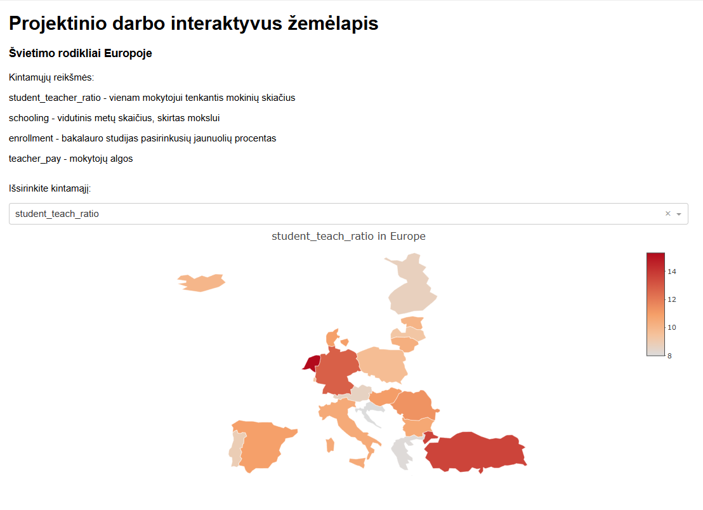
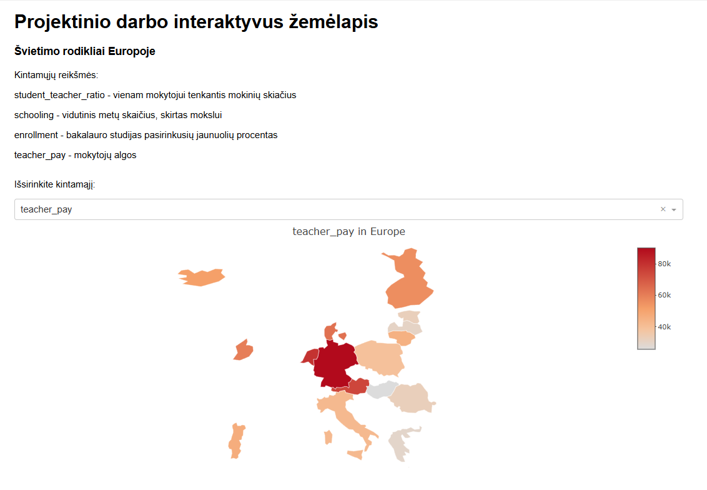

```{r, include=FALSE}
Sys.setlocale("LC_ALL", "lithuanian")
```

```{r, include=FALSE}
library(tidyr)
library(dplyr)
library(mice)
library(lubridate)
library(rnaturalearth)
library(rnaturalearthdata)
library(eurostat)
library(countrycode)
library(knitr)
library(ggplot2)
library(ggstream)
library(plotly)
library(dash)
library(sf)
```

\begin{center}
\includegraphics[width=0.5\textwidth]{vu_logo.png}\vspace{1cm}

{
  \Large
  Vilniaus universitetas\\
  Matematikos ir Informatikos fakultetas\\
  Duomenų mokslas, II kursas
}
  \par
          
  \vspace{3.5cm}
  
  Lukas Janušauskas
  \par
          
  \textbf{\large Europos švietimo rodiklių analizė}\vspace{0.8cm}
  \par
          
  Projektinis duomenų vizualizavimo projektas \vfill
      
  2020 gegužė
\end{center}

\pagebreak

\tableofcontents

\pagebreak

## Tikslas

Ištirti švietimo rodiklius Europos šalyse: skirtumus tarp Europos regionų, 
mokytojų darbo krūvio ir algų, skirtingų pasiskirstymų.

## Užduotys

1. Pavaizduoti duomenis, pasitelkiant PCA.
2. Ištirti PCA komponenčių scree plot.
3. Ištirti skirtumus tarp Europos regionų, kalbant apie mokinio, tenkančio mokytojai vidurkius.
4. Sukurti įrankį išsianalizuoti skirtingus rodiklius Europoje interaktyviai.

## Duomenys

Duomenų šaltiniai:

1. **EUROSTAT**. Naudotas mokinių, tenkančių vienam mokytojui rodiklis.
2. **OECD**. Naudotas mokytojų algų rodiklis ir stojimo procentas.
3. **ourworldindata**. Naudotas vidutinis metų skaičius, skirtas mokslui.
4. **rnaturalearth**. Gauti šalių regionai ir geografinės koordinatės žemėlapių brėžimui.

\begin{center}
1 lentelė: duomenys, jų paaiškinimai ir tipai.
\end{center}

| Stulpelis | Reikšmė | Tipas |
| --- | --- | --- |
| `geo` | ISO 3 simbolių šalies kodas | `chr` |
| `student_teach_ratio` | Studentų, tenkančių vienam mokytojui vidurkis  | `numeric` |
| `schooling` | Vidutinis skaičius metų, kuriuos skiria mokslui | `numeric` |
| `enrollment` | Procentas stoajnčiųjų į bakalauro programas | `numeric` |
| `teacher_pa` | Mokytojų alga | `numeric` |
| `subregion` | Europos regionas | `chr` |

```{r, message=FALSE, warning=FALSE, results='hide'}
schooling <- read.csv('data/expected-years-of-schooling.csv')
schooling <- schooling %>% 
  rename(schooling = 'Expected.years.of.schooling',
         geo = 'Code') %>% 
  filter(Year == 2022, geo != "") %>% 
  select(c('geo', 'schooling'))

ratio_st <- get_eurostat('educ_uoe_perp04')
ratio_st <- ratio_st %>% 
  filter(isced11 == 'ED2',
         TIME_PERIOD == '2022-01-01') %>% 
  mutate(geo = countrycode(geo, 'eurostat', 'iso3c')) %>% 
  rename('student_teach_ratio' = 'values') %>% 
  select(c('geo', 'student_teach_ratio'))
  

students <- read.csv('data/oecd_students.csv')
students <- students %>% 
  filter(INST_TYPE_EDU == 'INST_EDU_PUB',
         EDUCATION_LEV == 'ISCED11_6') %>% 
  rename("enrollment" = "OBS_VALUE",
         "geo" = 'REF_AREA') %>% 
  select(c('geo', 'enrollment'))

teach_pay <- read.csv('data/oecd_teachers.csv')
teach_pay <- teach_pay %>% 
  rename('geo' = 'REF_AREA',
         'teacher_pay' = 'OBS_VALUE') %>% 
  filter(PERS_TYPE == 'TE',
         EDUCATION_LEV == 'ISCED11_24',
         REF_PERIOD == 2022) %>% 
  select(c('geo', 'teacher_pay'))

df <- ratio_st %>% 
  inner_join(schooling, by=join_by('geo')) %>% 
  inner_join(students, by=join_by('geo')) %>% 
  inner_join(teach_pay, by=join_by('geo'))

cols <- c(colnames(df), 'subregion')

df <- df %>% 
  inner_join(ne_countries(), by=join_by("geo" == "iso_a3")) %>% 
  filter(sapply(subregion, function(x) grepl('Europe', x))) %>% 
  select(cols)
```

```{r}
kable(head(df), caption="Paruoštų duomenų rinkinio pirmos 6 eilutės")
```

\pagebreak

## PCA

### SVD metodas

Trumpai prsitatysiu PCA, kad galėtumėte suprasti sekančius punktus.
Pakete, kurį naudojau, pagrindinių komponenčių analizė buvo implementuota, naudojant singular value decomposition. 
Kiti, modernesni, pasirinkimai buvo t-SNE ir UMAP, tačiau duomenų kiekis nebuvo didelis, todėl naudojau SVD.


Tegu mūsų reikšmės bus matrica $X$, tada ši matrica faktorizuojama pagal formulę:

\begin{equation}
  X = U\Sigma V^T
\end{equation}

Čia $U$, $V$ - matricos sudarytos iš kairiųjų ir dešiniųjų tikrinių vektorių (angl. left and right singtular vectors),
$\Sigma$ - diagonalinė matrica, sudaryta iš kairiųjų ir dešiniųjų tikrinių reikšmių (angl. eigenvalues). Šis metodas yra geresnis už kanoninę formą $U \Lambda U^{-1}$ tuo, kad reikalavimai matricai $X$ yra žymiai lankstesni.

**Svarbus faktas** - $\Sigma$ pagrindinėje įstrižainėje esančios tikrinės reikšmės(jų šaknys)
atitinka paaiškintą dispersiją. Tiriant PCA, dažnai šios dispersijos yra tiriamos, norint nustatyti, kiek komponenčių užteks. Tai pavaizduosiu vadinamu scree plot.


Duomenų paruošimui reikia imputuoti praleistus duomenis. Kadangi duomenyse negali 
būti praleistų reikšmių, naudosiu CART algoritmą (medžiais paremtą ML-modelį), iš
paketo `mice`.

Toliau, paprasčiausiai naudojantis paketu `stats` pasinaudojau `prcomp`.

```{r, results='hide'}
raw_data <- select(df, -c('geo', 'subregion'))

imp <- mice(raw_data, method="cart")
pr_comp_data <- complete(imp)

pr_comp_res <- prcomp(pr_comp_data)
```

### Scree plot

Prieš jungiant pagrinines komponentes su duomenimis, nusibrėžkime scree plot ištirti
komponenčių tikrines reikšmes, kurios kaip žinome atstoja paaiškintą dispersiją.

```{r, warning=FALSE}
eigenvalues <- pr_comp_res$sdev ^ 2

expl_var <- eigenvalues / sum(eigenvalues) * 100

plot_data <-   data.frame(
    Komponente = 1:length(eigenvalues),
    `Tikrine reiksme` = eigenvalues,
    expl_var = expl_var
)

ggplot(plot_data) +
    geom_line(aes(x = Komponente, y = expl_var),
               size=2, color="#78003F") +
    geom_point(aes(x = Komponente, y = expl_var),
               size=5, color="#E64164") +
    labs(
      title = "Scree plot",
      x = "Komponentės nr.",
      y = "Paaiškinta dispersija (%)"
    ) +
    theme_minimal(base_family = "Helvetica") +
    theme(
      plot.title = element_text(hjust = 0.5, size = 20, face = "bold"),
      axis.title = element_text(size = 14),
      axis.text = element_text(size = 12),
      panel.grid.major.x = element_blank(),
      panel.grid.minor = element_blank(),
      legend.position = "bottom"
    )
```

\begin{center}
  1 grafikas. Scree plot
\end{center}

Šis grafikas padeda nustatyti optimalų komponenčių skaičių.
Jame ant $y$ ašies pavaizduota $x$-osios komponentės tikrinės reikšmės kvadratas (sąlginis).
Kadangi jis atstoja paaiškintą dispersiją, tai galime interpretuoti, kaip komponentės "naudingumą".
Beveik visada atsiranda alkūnė (realaus gyvenimo taikymuose kartais 2-3), ties kuria
galime nustatyti, kiek komponenčių užtenka duomenų dimensijai sumažinti.

Iš šio grafiko "alkūnės" matome, kad vienos komponentės pilnai užtenka - visos sekančios 
nėra tokios prasmingos. Tačiau dėl vizualizavimo priežasčių bus naudojamos dvi.

\pagebreak

### PCA iliustracija

```{r}
pr_comp_decomp <- pr_comp_res[['x']]

df_pca <- cbind(df, pr_comp_decomp)

df_pca %>% 
  ggplot() +
    geom_point(aes(x=PC1, y=PC2, color=subregion),
               size=6, alpha=0.75) +
    scale_color_manual(values=colorRampPalette(c("#4164e6", "#64e641", "#e64164"))(4),
                       name="Regionas") + 
    theme_minimal() +
    ggtitle("Pagrindinių komponenčių sklaidos diagrama") +
    theme(
      text = element_text(family = "Helvetica"),
      plot.title = element_text(size = 16, face = "bold", hjust = 0),
      plot.subtitle = element_text(size = 12, hjust = 0, margin = margin(b = 20)),
      axis.title = element_text(size = 12, face = "bold"),
      axis.text = element_text(size = 10),
      legend.title = element_text(size = 10, face = "bold"),
      legend.text = element_text(size = 9),
      legend.position = "right",
      plot.margin = margin(t = 20, r = 20, b = 20, l = 20),
      panel.grid.minor = element_blank()
    ) +
    labs(
      subtitle = "Pagrindinės komponentės ir Europos regionai",
      x = "Komponentė nr. 1",
      y = "Komponentė nr. 2"
    )
```


\begin{center}
  2 grafikas. Pagrindinių komponenčių analizės iliustracija - sklaidos diagrama
\end{center}

Visų pirma, trumpa pastabėlė: kadangi naudotas CART algoritmas interpoliacijai atsiranda stochastinis elementas programoje ir rezultatas visada maždaug skirtingas, taigi ir SVD rezultatai kitokie.

Dažniausiai (naudoju atsargius žodžius, kadangi atsiranda tikimybinis elementas),
aiškiai išskiriama Vakarų Europa ir Rytų Europa; Šiaurės ir Pietų Europos šalys būna gana arti.

Nors yra ir vertikalumo, tačiau ryškiausi skirtumai tarp kintamųjų pastebimi žvelgiant horizontaliai, pagal pirmąją komponentę. Tai paantina scree plot'ui, prie kurio teigiau,
kad užtenka vienos komponentės

\pagebreak

## Srauto grafikas

```{r, results='hide', warning=FALSE, message=FALSE}
ratio_st <- get_eurostat('educ_uoe_perp04')
ratio_st <- ratio_st %>% 
  filter(isced11 == 'ED2') %>% 
  mutate(geo = countrycode(geo, 'eurostat', 'iso3c')) %>% 
  rename('student_teach_ratio' = 'values') %>% 
  select(c('geo', 'TIME_PERIOD', 'student_teach_ratio')) %>% 
  drop_na()
```

```{r, message=FALSE}
ratio_st %>% 
  inner_join(ne_countries(), by=join_by("geo" == "iso_a3")) %>% 
  select(c(colnames(ratio_st), 'subregion')) %>% 
  filter(sapply(subregion, function(x) grepl('Europe', x))) %>% 
  group_by(subregion, TIME_PERIOD) %>% 
  summarize(
    mean_val = mean(student_teach_ratio)
  ) %>% 
  ggplot(aes(x = TIME_PERIOD, y = mean_val, fill = subregion)) +
    scale_fill_manual(values=colorRampPalette(c("#003f78", "#ff3da1"))(4),
                       name="Regionas:") + 
    geom_stream() +
  labs(
    title = "Mokinio / mokytojui santykio pasiskirstymas Europoje",
    x = "Metai",
    y = ""
  ) +
  theme_minimal(base_size = 14, base_family = "Helvetica") +
  theme(
    plot.title = element_text(face = "bold", size = 14, hjust = 0.5),
    axis.title = element_text(size = 12),
    axis.text = element_text(size = 11, color = "gray20"),
    axis.text.y = element_blank(),
    legend.position = "bottom",
    legend.title = element_text(size=10, face="bold"),
    legend.text = element_text(size=9),
    panel.grid.major = element_line(color = "gray90"),
    panel.grid.minor = element_blank(),
    plot.background = element_rect(fill = "white", color = NA),
    panel.background = element_rect(fill = "white", color = NA),
    plot.margin = margin(20, 20, 20, 20)
  )

```

\begin{center}
  3 grafikas. Europos rergionų mokinio/mokytojui santykio srauto grafikas
\end{center}

Srauto grafikas (angl. streamgraph), vaizduoja kategorijų pasiskirstymą laike.
Jis skiriasi nuo plokštuminio grafiko tuo, kad srauto grafikas yra centruotas.

Šiame grafike $y$ ašyje atidėta mokinio, atitinkančio vienam mokytojui vidurkį (tiksliau šio rodiklio kiekvieno regiono proporciją).
Matome, kad kiekviename laiko taške proporcijos yra tolygios (santykis mokinių mokytojui maždaug sutampa).

Taigi, metams einant, mokinio/mokytojui rodiklis skirtinguose regionuose nesikeičia.

*Pastabėlė: nežinau iš kur atsirado šis "bangavimas" - atrodo galima imti ir tirti laiko eilučių sezoniškumą, braižyti periodogramą, taičiau pasirinkus `type=proportional`, gaunamos visiškai tiesios linijos.*

\pagebreak

## Interaktyvus žemėlapis

Paruošiame duomenis interkatyviam grafikui: pridedame regioną, pridedame hover tekstą.

```{r, eval=FALSE}
df_plot <- df %>% 
  left_join(ne_countries(), by=join_by("geo" == "iso_a3")) %>% 
  rename("subregion" = "subregion.x") %>% 
  select(c(colnames(df), geometry))

df_plot$hover_text <- paste(
  "<b>", df_plot$geo, "</b>",
  "<br>Student teacher ratio:", df_plot$student_teach_ratio,
  "<br>Expected schooling:", df_plot$schooling,
  "<br>Bashelor's degree enrollment: $", df_plot$enrollment
)
```

Apibrėžiame funkciją, skirtą žemėlapio braižymui.

```{r, eval=FALSE}
draw_map <- function (col) {
  bbox <- st_bbox(df_plot$geometry)
  
  fig <- plot_ly(
    data = df_plot,
    type = 'choropleth',
    locations = ~geo,
    locationmode = 'ISO-3',
    z = df_plot[[col]],
    text = ~hover_text,
    hoverinfo = "text",
    colorscale = "turbo",
    cmin = min(df_plot[[col]]),
    cmax = max(df_plot[[col]]),
    marker = list(line = list(color = 'white', width = 0.5))
  ) %>%
    layout(
      geo = list(
        lonaxis = list(range = c(bbox["xmin"], bbox["xmax"])),
        lataxis = list(range = c(bbox["ymin"], bbox["ymax"])),
        showframe = FALSE,
        showcoastlines = FALSE,
        projection = list(type = 'natural earth')
      ),
      title = paste(col, "in Europe")
    )
  
  return (fig) 
}
```

Apibrėžiame app'o išdėstymą su dash HTML komponentėmis.

```{r, eval=FALSE}
app <- dash_app() %>% set_layout(
  html$main(
  div(
    html$h1("Projektinio darbo interaktyvus žemėlapis"),
    html$h3("Švietimo rodikliai Europoje"),
    div(
      div(
        html$p("Išsirinkite kintamąjį:"),
        dccDropdown(
          id = 'column',
          options = c(
            "student_teach_ratio",
            "schooling",
            "enrollment",
            "teacher_pay"
          ),
          value = "student_teach_ratio",
        ),
        style=list(
          "width" = "75%"
        )
      ),
      style=list(
        "width" = "100%",
        "display" = "flex"
      )
    ),
    dccGraph(
      id = "main-graph",
      style=list(
        width = "75%",
        "margin-top" = "10pt"
      )  
    ),
    style=list(
     "width" = "75%",
     "font-family" = "Helvetica",
     "margin" = "auto"
    )
  )
  )
)
```

Paleidžiame programėlę.

```{r, eval=FALSE}
app %>% add_callback(
  output('main-graph', 'figure'),
  input('column', 'value'),
  draw_map
)

run_app(app)
```

Programėlėje yra pateikti kintamųjų aprašymai, kadangi pasirenkama kintamasis grynas,
toks, koks yra duomenų rinkinyje (pavadinimai gali būti nesuprantami).

Pasirinkus kintamąjį iškarto pakeičiamas žemėlapis atitinkamai.

Pateikiami pavyzdžiai, kaip atrodo programėlė:



\begin{center}
  4 lentelė. I interaktyvaus grafiko variantas
\end{center}



\begin{center}
  5 lentelė. II interaktyvaus grafiko variantas.
\end{center}

\pagebreak

## Šaltiniai

1. Alan Edelman paskaitų skaidrės, skyrius 7 the singular value decomposition (SVD). (n.d.). https://math.mit.edu/classes/18.095/2016IAP/lec2/SVD_Notes.pdf 

2. EUROSTAT. (2024). Participants in formal education by sex, type of institution and intensity of participation (educ_uoe_perp04) [Duomenų rinkinys]. https://doi.org/10.2908/EDUC_UOE_PERP04

3. OECD. (n.d.). Education and skills: Teachers [Duomenų rinkinys]. OECD Data Explorer. Pasiekta 2025 gegužės 16.
https://data-explorer.oecd.org/vis?fs[0]=Topic%2C1%7CEducation%20and%20skills%23EDU%23%7CTeachers%23EDU_TEA%23&pg=0&fc=Topic&bp=true&snb=50&df[ds]=dsDisseminateFinalDMZ&df[id]=DSD_EAG_SAL_ACT%40DF_EAG_SAL_ACT_ALL&df[ag]=OECD.EDU.IMEP&df[vs]=1.1

4. OECD. (n.d.). Education and skills: Students by institution type [Duomenų rinkinys]. OECD Data Explorer. Pasiekta 2025 gegužės 16.
https://data-explorer.oecd.org/vis?fs[0]=Topic%2C1%7CEducation%20and%20skills%23EDU%23%7CStudents%23EDU_STU%23&pg=0&bp=true&snb=31&df[ds]=dsDisseminateFinalDMZ&df[id]=DSD_EAG_UOE_NON_FIN_STUD%40DF_UOE_NF_SHARE_INST&df[ag]=OECD.EDU.IMEP&df[vs]=1.0

5. ourworldindata.org. Roser, M., Ortiz-Ospina, E., & Ritchie, H. (n.d.). Expected years of schooling [Duomenų rinkinys]. Our World in Data. 
Pasiekta 2025 gegužės 16. 
https://ourworldindata.org/grapher/expected-years-of-schooling

6. ChatGPT. Pagalba su citavimu, grafikų vizualiu tobulinimu.

7. Claude Sonnet. Pagalba su vertimu, grafikų vizualiu tobulinimu.
